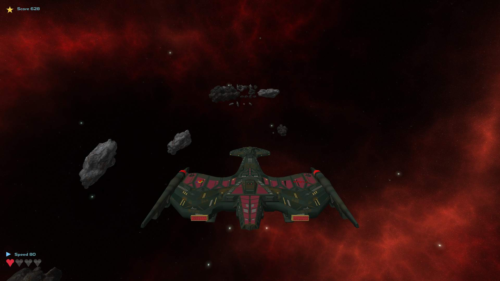

# AstroRush

A 3D space endless runner game built with **C++ and OpenGL**.

## Features

- 3D endless runner gameplay
- Space environment with a rotating skybox
- Player-controlled spaceship
- Dynamic obstacle spawning
- Collision detection system
- Health and damage system
- Speed acceleration mechanics
- Custom Dear ImGui-based HUD and menus
- Asset loading screen

## Screenshots

## Controls

| Key   | Action                    |
| ----- | ------------------------- |
| ← / → | Move spaceship left/right |
| ↑     | Accelerate                |
| ↓     | Decelerate                |
| Space | Change altitude           |
| Esc   | Pause game                |
| F     | Toggle fullscreen         |

## Requirements

- **C++-17**
- **OpenGL 3.3**
- **GLFW**
- **GLEW**
- **GLM**
- **Dear ImGUI v1.92.8**
- **stb_image - v2.30**
- **tiny_obj_loader v2.0.0**
- **CMake v3.16 (minimum required)**

# Installation Guide (Development)

## Arch Linux

### 1. Install dependencies

Install the required packages using pacman:

    sudo pacman -S --needed base-devel cmake git glfw glew glm

### 2. Clone the repository

    git clone https://github.com/SaeedAlian/astro-rush.git
    git submodule update --init --recursive
    cd astro-rush

### 3. Build the project

Create a build directory:

    mkdir build
    cd build

Generate build files:

    cmake ..

Compile:

    make -j$(nproc)

### 4. Run the game

    ./astro-rush

---

## Debian / Ubuntu Based Distributions

### 1. Install dependencies

Update package lists:

    sudo apt update

Install required packages:

    sudo apt install \
        build-essential \
        cmake \
        git \
        libglfw3-dev \
        libglew-dev \
        libglm-dev

### 2. Clone the repository

    git clone https://github.com/SaeedAlian/astro-rush.git
    git submodule update --init --recursive
    cd astro-rush

### 3. Build the project

Create a build directory:

    mkdir build
    cd build

Generate build files:

    cmake ..

Compile:

    make -j$(nproc)

### 4. Run the game

    ./astro-rush

---

## RPM Based Distributions

### 1. Install dependencies

#### Fedora / RHEL / Rocky / AlmaLinux

    sudo dnf install \
        gcc-c++ \
        cmake \
        git \
        glfw-devel \
        glew-devel \
        glm-devel

### 2. Clone the repository

    git clone https://github.com/SaeedAlian/astro-rush.git
    git submodule update --init --recursive
    cd astro-rush

### 3. Build the project

Create a build directory:

    mkdir build
    cd build

Generate build files:

    cmake ..

Compile:

    make -j$(nproc)

### 4. Run the game

    ./astro-rush

---

# Notes

- AstroRush uses CMake as its build system.
- Generated build files should not be committed to the repository.
- Always build inside a separate build directory.
- A GPU supporting OpenGL 3.3 or newer is required.
